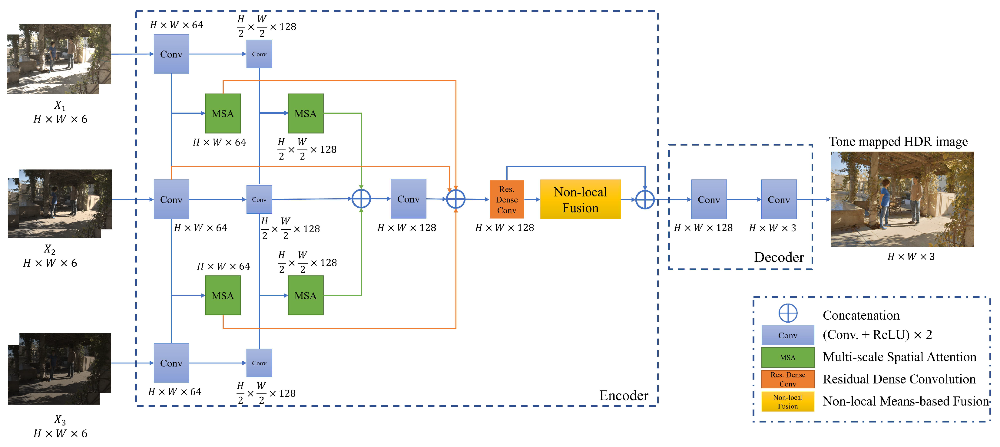
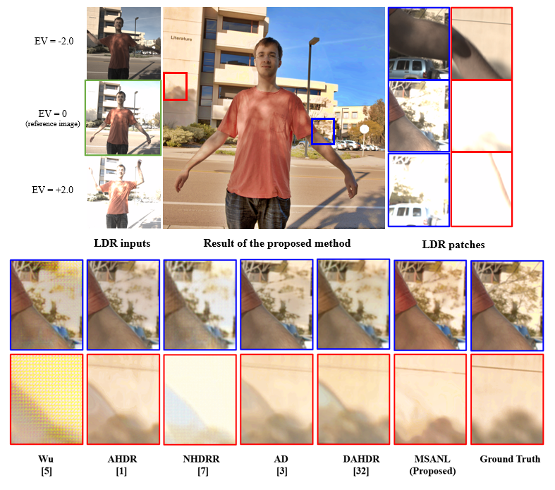

# 🌈 Multi-Scale Attention-Guided Non-Local Network (MSANLNet)

PyTorch implementation of the proposed model from the published paper:

**Multi-Scale Attention-Guided Non-Local Network for HDR Image Reconstruction**  
Published in *Sensors*, 2022.  
DOI: https://doi.org/10.3390/s22197044

---

## 📌 Overview

This work proposes a multi-exposure HDR reconstruction network integrating:

- Multi-Scale Spatial Attention (MSA)
- Residual Dense Convolution Blocks
- Non-local means-based feature fusion
- Encoder–decoder structure

Three exposure images (X1, X2, X3) are used to reconstruct a 3-channel HDR image.

---

## 🏗 Network Architecture

  

---

## 📊 Quantitative Results

| Method | PSNR-l | PSNR-μ | SSIM |
|--------|--------|--------|------|
| MSANet | 37.1958 | 39.5646 | 0.9699 |
| ANLnet | 39.0193 | 40.6810 | 0.9781 |
| **MSANLNet (Proposed)** | **40.4370** | **42.7466** | **0.9821** |

The proposed method achieves superior performance across all evaluation metrics.

---

## 🖼 Visual Results

  

---

## 📦 Dataset

This work uses the **SIGGRAPH 2017 HDR Dataset (Dynamic Scenes)**  
introduced in:

N. K. Kalantari and R. Ramamoorthi,  
*Deep High Dynamic Range Imaging of Dynamic Scenes*,  
ACM Transactions on Graphics (SIGGRAPH 2017), 36(4), 2017.

Dataset website:  
👉 https://cseweb.ucsd.edu/~viscomp/projects/SIG17HDR/

---
## 📎 Note

This repository provides the network architecture used in the published paper.  
